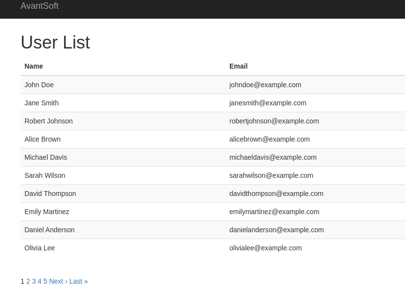
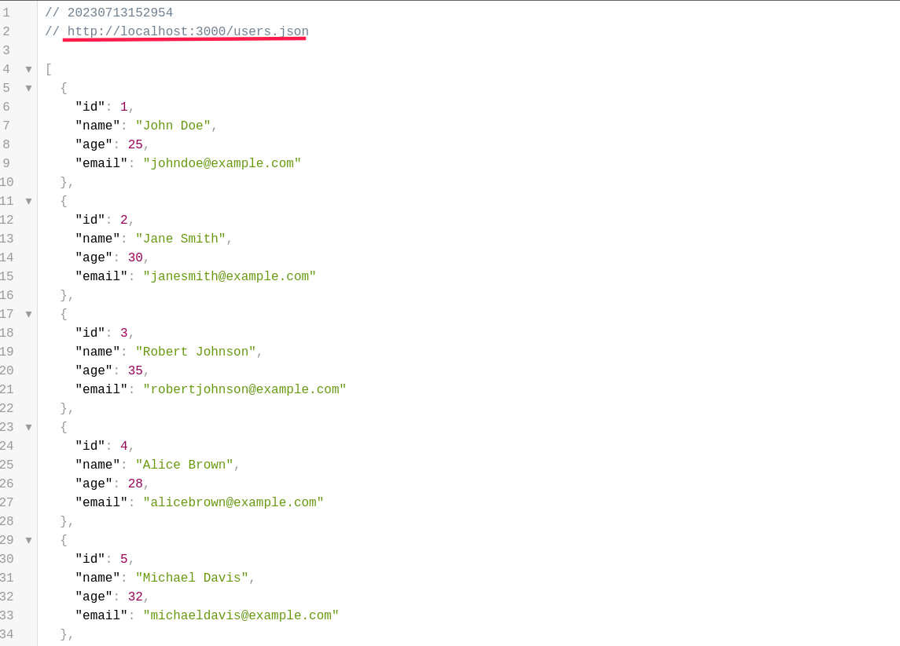

# README

User list system.

## Technologies Used

- Ruby on Rails 7
- ruby "3.2.0"
- gem 'bootstrap-generators', '~> 3.3.4'
- gem 'record_tag_helper', '~> 1.0'
- gem 'will_paginate'
- gem 'kaminari'
- gem 'sprockets', '~> 3.7.2'
- gem 'rails-controller-testing's
- gem 'rspec-rails', '~> 6.0.0'

## Autores

- [Nome do Autor](https://github.com/DTOX40)

## Project Status

This project is under active development and is currently at version 1.0.1.

## Examples and Screenshots

